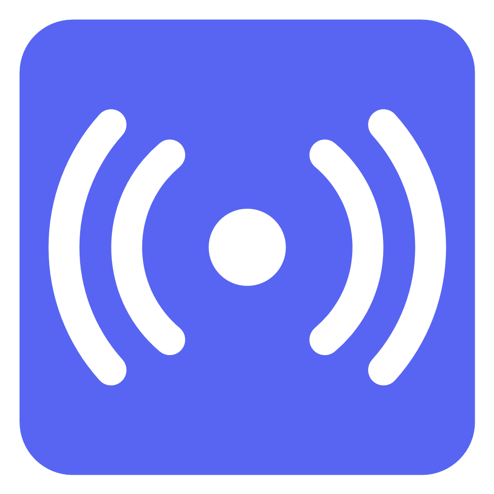
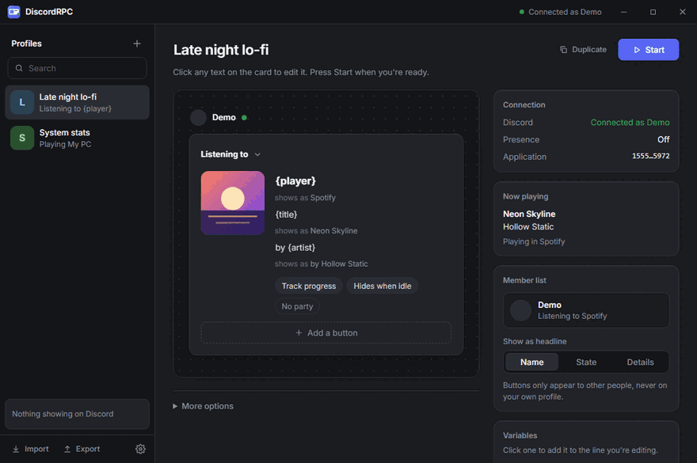
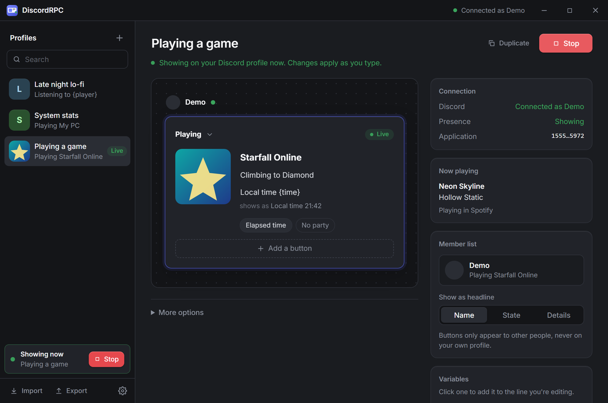

<div align="center">



# DiscordRPC

### Custom Discord Rich Presence in two clicks. No developer portal. No scripts.

Design a status card, press **Start**, and it's on your Discord profile.
Show a game, a song, a show, your CPU, or anything else you want people to see.

[](https://github.com/TrxrKnocks/discordrpc/releases/latest)
[](https://github.com/TrxrKnocks/discordrpc/releases)
[](LICENSE)


**[Download](https://github.com/TrxrKnocks/discordrpc/releases/latest)** ·
**[Quick start](#quick-start)** ·
**[Variables](#live-variables)** ·
**[FAQ](#faq)**

</div>

<div align="center">

</div>

---

## Why this exists

Custom Rich Presence usually means registering an application in the Discord developer portal, copying IDs around, and running a script in a terminal that you have to keep open.

DiscordRPC replaces all of that with a window. You edit a card that looks like the one Discord shows, and what you type is what people see.

- **No developer portal.** The text after "Playing" comes from the Name field. A default application ID is built in, and you can use your own if you want to.
- **Edit it live.** Change a line while the profile is running and it updates on your profile.
- **Tiny and quick.** Built with Tauri, so the installer is a few megabytes and it idles at a small memory footprint. It doesn't ship a browser.
- **Free and open source.** MIT licensed, no account, no ads.

## What you can do

| | |
|---|---|
| **Edit on the card** | Activity type (Playing, Listening, Watching and more), name, two text lines, large and small images, timer, party size and up to two buttons. |
| **Profiles** | Keep as many as you like. Start from a template, then search, tag, duplicate, import and export them. |
| **Live variables** | Put `{time}`, `{cpu}`, `{uptime}` and friends in any line and they refresh while you're live. |
| **Now playing** | Follow whatever you're listening to with title, artist, album, cover art and a progress bar. |
| **Image uploads** | Pick an image from disk instead of hunting for a link. |
| **Stays out of the way** | Tray icon, launch at sign-in, start hidden, close to tray. |
| **Looks right** | Light and dark themes, accent colours, optional sound effects. |

<div align="center">

</div>

## Quick start

1. **[Download](https://github.com/TrxrKnocks/discordrpc/releases/latest)** the installer for your system and open it.
2. Make sure the Discord desktop app is running.
3. Click **+** to create a profile and pick a template.
4. Click the text on the card to change it. Click the artwork to set images.
5. Press **Start**.

That's it. If Discord restarts, the app reconnects on its own.

## Templates

Start from one of these and change whatever you like.

| Template | What it shows |
|---|---|
| Playing a game | Game name, a status line and an elapsed timer |
| Listening to music | Shows as "Listening to" |
| Watching something | Shows as "Watching" |
| Working | Your local time next to what you're doing |
| Now playing | Follows your player with track, artist, cover and progress |
| System stats | CPU, memory and uptime, updated live |
| Blank | Start from nothing |

## Live variables

Type these into any text line. They're replaced with the current value and kept fresh while the profile is live.

| Variable | Value |
|---|---|
| `{time}` / `{time12}` | Local time, 24-hour or 12-hour |
| `{date}` | Local date, `YYYY-MM-DD` |
| `{weekday}` | Day of the week |
| `{uptime}` | System uptime |
| `{cpu}` | CPU usage in percent |
| `{ram}` | Memory usage in percent |
| `{ram_used}` / `{ram_total}` | Memory in use and installed, in GB |
| `{os}` | Operating system name |
| `{title}` `{artist}` `{album}` `{player}` | What's playing right now |
| `{cover}` | Cover art for the current track |

For example, this is how the built-in **Now playing** template is set up:

```text
Name        {player}
Line 1      {title}
Line 2      by {artist}
Large image {cover}
Hover text  {album}
Timer       Follow the media progress
```

And this is **System stats**:

```text
Name    My PC
Line 1  CPU {cpu}%  |  RAM {ram}%
Line 2  Up for {uptime}
```

## Install

Grab the installer for your system from the **[releases page](https://github.com/TrxrKnocks/discordrpc/releases/latest)**. There is also a portable zip for Windows.

| System | Download |
|---|---|
| Windows | Installer, or the portable zip |
| macOS | Apple Silicon and Intel builds |
| Linux | Packages from the same page |

The builds are not code signed yet, so Windows SmartScreen and macOS Gatekeeper will warn the first time you open the app. On Windows choose **More info**, then **Run anyway**. On macOS, right-click the app and choose **Open**.

## FAQ

**Do I need to create a Discord application?**
No. The name on your profile comes from the Name field, and a default application ID is built in. You can enter your own under Settings if you prefer.

**Does it need my Discord login or token?**
No. It talks to the Discord desktop app running on your machine, the same way games do. It never asks you to sign in.

**Why can't I see my own buttons?**
Discord only shows buttons to other people. They don't appear on your own profile, but they're there for everyone else.

**Does it work with the web version of Discord?**
No. Rich Presence needs the Discord desktop app to be running.

**Does it send anything over the internet?**
Only in three optional cases, listed under [Network use](#network-use).

## Network use

The app talks to the internet in three cases, all optional:

- **Cover art**: if a profile uses `{cover}`, it asks the iTunes Search API for album art matching the current track.
- **Image uploads**: only when you press Upload. The file goes to [catbox.moe](https://catbox.moe), a free public host, and you're asked before the first one.
- **Update checks**: it looks at this repository's releases on startup. You can turn that off in Settings.

Now-playing information is read locally from the operating system and never leaves your machine, apart from the cover lookup above.

## Platform notes

Now playing reads the Windows media session, MPRIS on Linux, and Spotify or Music through AppleScript on macOS. The Windows path gets the most use. The Linux and macOS ones are newer, so reports are welcome.

## Building from source

You need Node 22, pnpm, and the [Tauri prerequisites](https://tauri.app/start/prerequisites/) for your platform. On Linux, `libdbus-1-dev` is needed too for media detection.

```sh
pnpm install
pnpm tauri dev      # run it
pnpm tauri build    # make an installer
```

Release builds also produce signed update files, which needs the project's signing key. For a local build without it:

```sh
pnpm tauri build --config '{"bundle":{"createUpdaterArtifacts":false}}'
```

Checks:

```sh
pnpm check
cargo test --manifest-path src-tauri/Cargo.toml
```

## Contributing

Bug reports, feature ideas and pull requests are welcome. See [CONTRIBUTING.md](CONTRIBUTING.md), or open an [issue](https://github.com/TrxrKnocks/discordrpc/issues/new/choose). If the app is useful to you, a star on the repo helps other people find it.

## License

MIT. See [LICENSE](LICENSE). This project isn't affiliated with or endorsed by Discord Inc.
